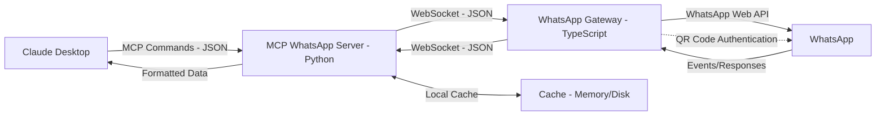

# MCP WhatsApp

MCP WhatsApp is a bridge between Claude Desktop and WhatsApp, enabling interaction with your WhatsApp account through Claude's AI capabilities using the `whatsapp-web.js` library.

## 🌟 Features

- **WhatsApp Integration**: Connect to WhatsApp using QR code authentication
- **Contact Management**: List and search your WhatsApp contacts
- **Group Management**: List and interact with your WhatsApp groups
- **Messaging**: Send and receive text messages
- **Message History**: Access and search chat history
- **Local Caching**: Store data locally for improved performance

- Media Messages and Media Support (Handle images, videos, documents, and audio) will be available in future versions

## 🏗️ Architecture

The project consists of two main services:

1. **WhatsApp Gateway** (TypeScript)

   - Authenticates with WhatsApp via QR code
   - Manages WhatsApp connection using `whatsapp-web.js`
   - Provides WebSocket API for the MCP server

2. **MCP WhatsApp Server** (Python)

   - Acts as an MCP endpoint for Claude Desktop
   - Processes commands from Claude
   - Communicates with the WhatsApp Gateway
   - Manages local data caching
   

Below is a diagram illustrating the architecture of the MCP WhatsApp project:



This diagram shows:

- **Claude Desktop**: The user interface sending MCP commands.
- **MCP WhatsApp Server**: Processes commands, manages cache, and communicates with the WhatsApp Gateway.
- **WhatsApp Gateway**: Connects to WhatsApp and handles WebSocket communication.
- **WhatsApp**: The external service.
- **Cache**: Local storage for performance optimization.
- **Authentication**: QR code flow from WhatsApp Gateway to Claude Desktop.

## 🚀 Getting Started

### Prerequisites

- Node.js (v16+)
- npm (v8+)
- Python (3.9+)
- pip (latest)
- Claude Desktop
- Git (optional, for cloning)

### Installation

1. Clone the repository:

   ```bash
   git clone https://github.com/brunosantos/mcp-whatsapp.git
   cd mcp-whatsapp
   ```

2. Set up the WhatsApp Gateway:

   ```bash
   cd whatsapp-gateway
   npm install --save-dev jest ts-jest @types/jest
   cp .env.example .env  # Edit with your configuration (e.g., ports, paths)
   npm run build
   ```

3. Set up the MCP WhatsApp Server:

   ```bash
   cd ../whatsapp-mcp-server
   python -m venv venv  # Optional: Create virtual environment
   source venv/bin/activate  # Linux/macOS
   venv\Scripts\activate     # Windows
   pip install -r requirements.txt
   ```

4. Configure environment variables for the Server (see Setup Guide for details).

5. Configure Claude Desktop:

   - Copy `example_claude_desktop_config.json` to `~/.claude-desktop/mcp/whatsapp.json` (Linux/macOS) or `%USERPROFILE%\.claude-desktop\mcp\whatsapp.json` (Windows)
   - Update the configuration as needed

## 🔧 Usage

1. Start the WhatsApp Gateway:

   ```bash
   cd whatsapp-gateway
   npm start
   ```

2. Start the MCP WhatsApp Server:

   ```bash
   cd whatsapp-mcp-server
   source venv/bin/activate  # Linux/macOS, if using virtual environment
   venv\Scripts\activate     # Windows, if using virtual environment
   python -m src.server
   ```

3. Scan the QR code when prompted to authenticate with WhatsApp. Sessions expire after \~20 days, requiring re-authentication.

4. Open Claude Desktop and interact with your WhatsApp account.

See the Setup Guide for troubleshooting and log file locations.

## 📝 API Documentation

For detailed API documentation, refer to the API Documentation.

## 📚 Documentation

- Architecture Overview
- Setup Guide
- API Documentation

## 🔒 Security

This project accesses your WhatsApp account. Ensure you:

- Never share authentication tokens
- Review the code before running
- Run services on your personal device
- Validate inputs to prevent injection attacks
- Use secure session management (via `LocalAuth`)

## 📄 License

This project is licensed under the MIT License - see the LICENSE file for details.

## 🤝 Contributing

Contributions are welcome! Please submit a Pull Request. See CONTRIBUTING.md for guidelines.

## 🙏 Acknowledgements

- whatsapp-web.js for WhatsApp Web integration
- Claude Desktop team for the MCP framework