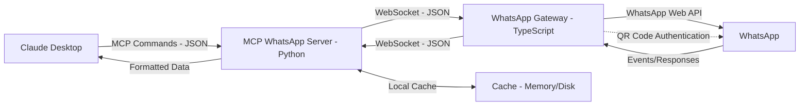

# MCP WhatsApp Architecture

This document describes the architecture of the MCP WhatsApp project, which integrates Claude Desktop with WhatsApp.

## Overview

The MCP WhatsApp project consists of two main services:

1. **WhatsApp Gateway**: A TypeScript service that connects to WhatsApp using the WhatsApp Web API.
2. **MCP WhatsApp Server**: A Python service that acts as an MCP endpoint for Claude Desktop.

These services communicate with each other using WebSockets, providing a bridge between Claude Desktop and WhatsApp.

### Architecture Diagram

Below is a diagram illustrating the architecture of the MCP WhatsApp project:

This diagram shows:

- **Claude Desktop**: The user interface sending MCP commands.
- **MCP WhatsApp Server**: Processes commands, manages cache, and communicates with the WhatsApp Gateway.
- **WhatsApp Gateway**: Connects to WhatsApp and handles WebSocket communication.
- **WhatsApp**: The external service.
- **Cache**: Local storage for performance optimization.
- **Authentication**: QR code flow from WhatsApp Gateway to Claude Desktop.

## Components

### WhatsApp Gateway

The WhatsApp Gateway handles direct communication with WhatsApp. It provides the following features:

- **Authentication**: Uses QR code authentication to connect to WhatsApp Web.
- **WebSocket Server**: Exposes a WebSocket API for the MCP WhatsApp Server.
- **WhatsApp Client**: Uses the `whatsapp-web.js` library to interact with WhatsApp.
- **Message Handling**: Processes incoming and outgoing messages.
- **Contact Management**: Provides access to WhatsApp contacts and groups.

Key components:

- **WhatsAppClient**: Manages the connection to WhatsApp and provides methods for sending/receiving messages, listing contacts, etc.
- **WebSocketServer**: Handles WebSocket connections from the MCP WhatsApp Server.
- **ErrorHandler**: Provides robust error handling and logging.

### MCP WhatsApp Server

The MCP WhatsApp Server is responsible for integrating with Claude Desktop through the MCP protocol. It provides:

- **MCP Endpoint**: Implements the MCP protocol for Claude Desktop.
- **WebSocket Client**: Connects to the WhatsApp Gateway.
- **Caching**: Stores message history, contacts, and other data locally for improved performance.
- **API**: RESTful API for interacting with the service programmatically.

Key components:

- **MCPHandler**: Handles MCP commands from Claude Desktop.
- **WhatsAppGatewayClient**: Communicates with the WhatsApp Gateway via WebSockets.
- **CacheManager**: Manages local caching of data.
- **ClaudeIntegration**: Helper utilities for formatting data for Claude.

## Communication Flow

The communication flow between components is as follows:

1. **User -&gt; Claude Desktop**: The user interacts with Claude Desktop.
2. **Claude Desktop -&gt; MCP WhatsApp Server**: Claude sends MCP commands to the server.
3. **MCP WhatsApp Server -&gt; WhatsApp Gateway**: The server translates MCP commands to WhatsApp Gateway commands.
4. **WhatsApp Gateway -&gt; WhatsApp**: The gateway communicates with WhatsApp using the WhatsApp Web API.
5. **WhatsApp -&gt; WhatsApp Gateway**: WhatsApp sends events and message updates to the gateway.
6. **WhatsApp Gateway -&gt; MCP WhatsApp Server**: The gateway forwards events to the server.
7. **MCP WhatsApp Server -&gt; Claude Desktop**: The server formats data and sends it to Claude Desktop.

## Authentication Flow

The authentication flow is as follows:

1. When the WhatsApp Gateway starts, it attempts to restore an existing session.
2. If no valid session exists, it generates a QR code for authentication.
3. The QR code is sent to the MCP WhatsApp Server, which forwards it to Claude Desktop.
4. The user scans the QR code with their phone's WhatsApp app.
5. Once authenticated, the WhatsApp Gateway maintains the session and notifies the MCP WhatsApp Server.

## Caching Strategy

To optimize performance and reduce network requests, the MCP WhatsApp Server implements a two-level caching strategy:

1. **Memory Cache**: Fast access cache for frequently accessed data.
2. **Disk Cache**: Persistent cache for long-term storage.

Cached data includes:

- Contacts and groups
- Chat messages
- Media files

Cache entries have configurable TTL (Time To Live) to ensure data freshness.

## Error Handling

Both services implement robust error handling:

- **Retry Logic**: Automatically retries failed operations with exponential backoff.
- **Circuit Breaking**: Detects and handles service outages gracefully.
- **Logging**: Comprehensive logging for troubleshooting.
- **User Feedback**: Provides meaningful error messages to the user through Claude Desktop.

## Security Considerations

The MCP WhatsApp project includes several security measures:

- **Local Processing**: All data is processed locally, with no external API calls.
- **No Token Storage**: No WhatsApp auth tokens are permanently stored.
- **Session Management**: WhatsApp sessions are stored securely using `LocalAuth` from `whatsapp-web.js`.
- **Input Validation**: All inputs are validated to prevent injection attacks.